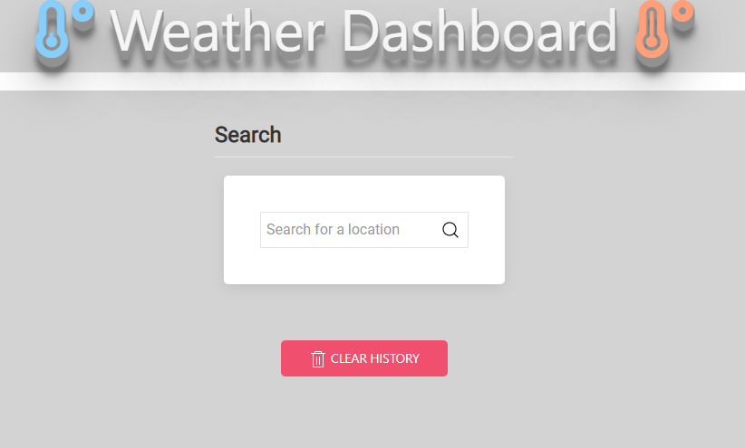
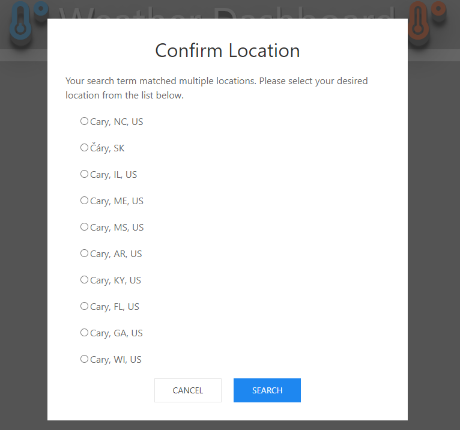
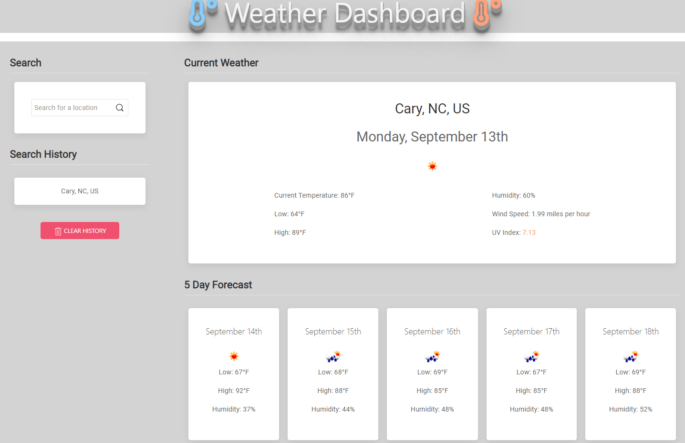

# Weather Dashboard

This Weather Dashboard can be utilized to view the weather forecast of given city/location.

## Screenshots





## How to Get There

Click on the below link to access the Weather Dashboard

https://hrsautomation20.github.io/weather_dashboard/

OR

Copy and paste below URL to your favorite browser

```html
https://hrsautomation20.github.io/weather_dashboard/
```

## Usage/Examples

1. On the landing page, Type desired city name and click search icon or press enter
2. It should show you an modal pop-up with matching city/states bases on geocoordination
3. Confirm the city which you would like to show the forecoast for using radio button and click submit
4. Your confirm city weather forecast will be showing with current day and 5 day forcast weather information

## Contributing

Contributions are always welcome!

For the Weather Dashboard enhancement please contact the repo owner and provide your feedback. To get a local copy pull/download.zip files are welcome.

## API/Framework Reference

- [OpenWeather](https://openweathermap.org/api/one-call-api)
- [CSS Framework](https://getuikit.com/)
- [GeoCode](https://developer.mapquest.com/)

## License

[MIT](https://choosealicense.com/licenses/mit/)
